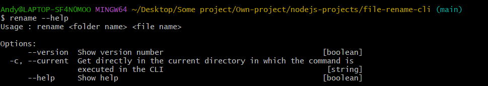

# file-rename

> A CLI tool to rename your file

# Screenshots

# Get started

Clone the repository and install all the packages

    git clone https://github.com/HandyyWeb/file-rename.git
    npm install

Install globally

    npm install -g

# Documentation

To see how it works, run `rename --help`

    rename --help
    Usage : rename <folder name> <file name>

    Options:
        --version  Show version number                                   [boolean]
    -c, --current Get directly in the current directory in which the command is
                    executed in the CLI [string]
        --help     Show help                                             [boolean]

# Basic Usage

Rename a specific within a specific folder by running the following command

    rename <folder name> <file name>

Example :

    rename test document.html // Rename the 'document.html file within the test folder

# Option

Use the `-c` or `--current` option to use the folder in which you currently are in the CLI as the folder path for the command

    rename -c <file name>

Example :

    Andy@LAPTOP-SF4N0MOO MINGW64 ~/Desktop/Some project/Own-project/nodejs-projects/file-rename-cli/test (main)
    $ rename -c document.html // Do the samer thing as the command rename test document.html

# Other libraries

- Inquirer : [Inquirer.js](http://adilapapaya.com/docs/inquirer/)

# Author & Contacts

Andy Lebreton

E-mail : lebreton.andy@proton.me
